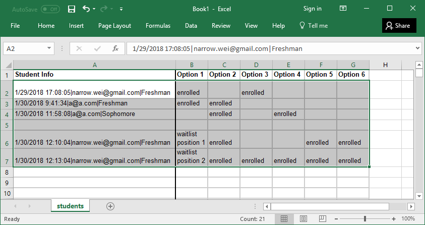
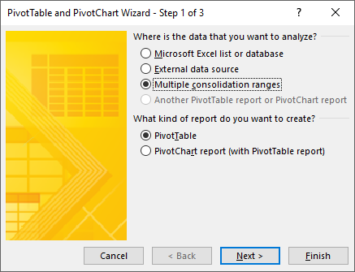
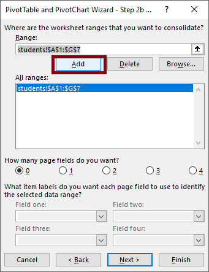
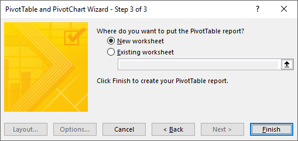
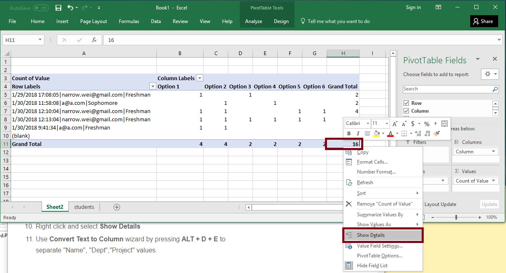

# Data Analysis
This [demo](https://docs.google.com/spreadsheets/d/1yYc1ecmeawc0_VqBrXIaNytGSHoxWJghUWh-cW0o8iM/edit?usp=sharing) processes the data dump of responses from Google Form into more readable format:
   - [Wide Form (students)](#wide-form-students): view each student/submission per row.
   - [Long Form (enrollments)](#long-form-enrollments): view one enrollment (each student in each class) per row, used for class roster.

## Wide Form (Students)
The wide form (the `students` tab) views one student per row, the student may have selected to enroll in multiple classes.

Here are the steps to extracting enrollment and waitlist information from Google Form's dump of response data to the `Form Responses 1` tab.  
Outputs are in columns `R:W` of the `students` tab.

## Long Form (Enrollments)
The long form (the `enrollments` tab) views one enrollment per row.  For example, if a student has selected to enroll in four classes, he will show up as four rows in the long form.

1. The long form is generated from the wide form, using a column that concatenates all the student's descriptive information --- `column D` on the `students` tab, and `column A` on the `enrollments` tab --- and the class enrollment information --- columns `R:W` on the `students` tab.

2. Copy the relevant columns `A`, `R:W` from the `students` tab into Microsoft Excel. 
   

Follow [these steps](http://www.listendata.com/2015/02/excel-formula-convert-data-from-wide-to.html) to create the long form using Microsoft Excel's Pivot Table feature.
   
   
   
   

Create a new tab `enrollments`.  Copy and paste the generated results from Microsoft Excel to the `enrollments` tab.

3. Splice the concatenated column using the [SPLIT](https://support.google.com/docs/answer/3094136?hl=en) formula to re-access the student's descriptive information --- `column B` on the `enrollments` tab.
