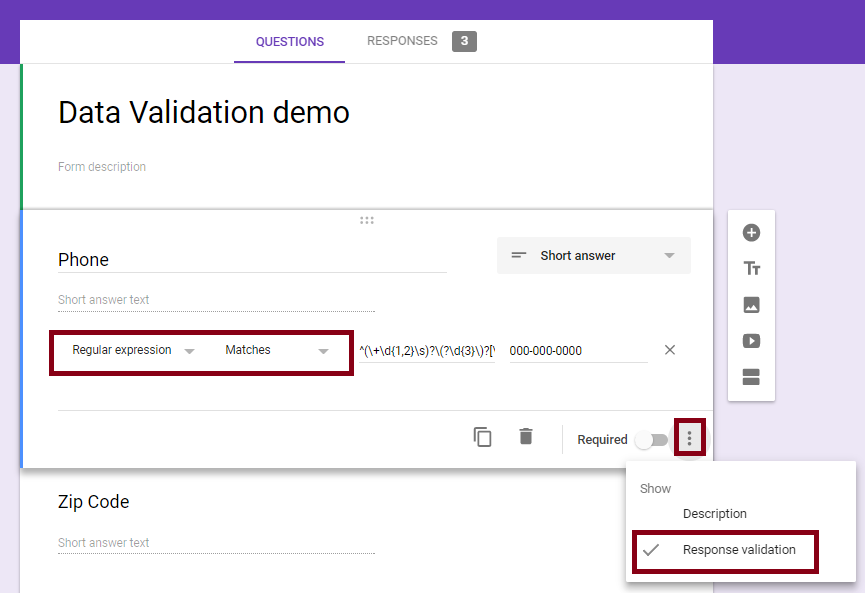

# Response Validation
Follow [these steps](https://support.google.com/docs/answer/3378864?hl=en) to set up Response Validation.

Here is a [demo Google Form](https://docs.google.com/forms/d/11O0dxNVd995oLX95Ix-tns1h9xJPSjglJPdBx0jVkoI/edit) demonstrating response validation for:
   - [US Phone Number](#phone-number)
   - [Zip Code](#zip-code)
   - [Email Address](#email-address)




You can test your [regular expressions online](https://regex101.com/).  Be sure to set regex options to `global` and `multi-line` using the `/mg` regex flag.


## Phone Number

Regular expression:
```regex
^(\+\d{1,2}\s)?\(?\d{3}\)?[\s.-]\d{3}[\s.-]\d{4}$
```

Matches the following:
```
123-456-7890
(123) 456-7890
123 456 7890
123.456.7890
123.456 7890
+91 (123) 456-7890
+1 123-456-7890
```

Doesn't match the following:
```
1234567890
(123)456 7890
+1-123-456-7890
```

Source: https://stackoverflow.com/a/16699507


## Zip Code

Regular expression:
```regex
^\d{5}(?:[-\s]\d{4})?$
```

Matches the following:
```
12345
12345-0000
12345 0000
```

Doesn't match the following:
```
123450000
```

Source: https://stackoverflow.com/a/2577239


## Email Address

Regular expression:
```regex
(?:[a-z0-9!#$%&'*+/=?^_`{|}~-]+(?:\.[a-z0-9!#$%&'*+/=?^_`{|}~-]+)*|"(?:[\x01-\x08\x0b\x0c\x0e-\x1f\x21\x23-\x5b\x5d-\x7f]|\\[\x01-\x09\x0b\x0c\x0e-\x7f])*")@(?:(?:[a-z0-9](?:[a-z0-9-]*[a-z0-9])?\.)+[a-z0-9](?:[a-z0-9-]*[a-z0-9])?|\[(?:(?:25[0-5]|2[0-4][0-9]|[01]?[0-9][0-9]?)\.){3}(?:25[0-5]|2[0-4][0-9]|[01]?[0-9][0-9]?|[a-z0-9-]*[a-z0-9]:(?:[\x01-\x08\x0b\x0c\x0e-\x1f\x21-\x5a\x53-\x7f]|\\[\x01-\x09\x0b\x0c\x0e-\x7f])+)\])
```

Matches the following:
```
a.b@c.com
```

Source: http://emailregex.com/
